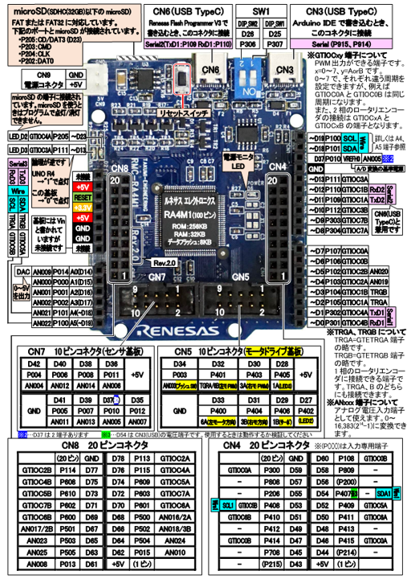

# LoRabbit🐰📡

自己進化する μT-Kernel 3.0 ベースの LoRa 通信ライブラリ for Renesas RA

# Overview

LoRabbit(ローラビット)は、Renesas RAシリーズマイコンとμT-Kernel環境向けのLoRa通信ライブラリです。大容量転送やAIによる通信自動最適化など、高度な機能を備えています。

# Feature

- 階層化アーキテクチャ
- 信頼性の高い大容量データ転送
- データ圧縮機能
- 通信履歴の自動保存
- AIによる適応型通信制御 (AI-ADR)

# Getting Started

## 対象環境

- MCU
  - Renesas RA シリーズで μT-Kernel 3.0 がサポートしているもの
  - 作者の手元では RA8D1 (EK-RA8D1) と RA4M1 (RMC-RA4M1) で動作確認を行っています
    - RMC-RA4M1 は Arduino UNO R4 MINIMA と互換性があるため、μT-Kernel 3.0 のサポートデバイスとなっています
- IDE
  - Renesas 製 e2_studio
  - 作者の手元では Version 2025-04 (25.4.0) で動作確認を行っています
- RTOS
  - μT-Kernel 3.0
- LoRa モジュール
  - CLEALINK 社製 E220-900T22S
  - 作者の手元では [E220-900T22S(JP) 用評価ボード][lora-ev-link] を用いて動作確認を行っています
  - 他のモジュール (E220-900T22S(JP)R2、E220-900T22L(JP)) につきましてはインターフェース仕様が共通のため動作すると思われますが、未確認です
- 書き込みソフト
  - Renesas 製 Renesas Flash Programmer
  - 作者の手元では V3.2.00 [1 July 2025] で動作確認を行っています

## EK-RA8D1 の場合

- EK-RA8D1 (Pmod 2 コネクタ) と E220-900T22S(JP) 用評価ボード を接続する
  - 配線については下記の接続表を参考にしてください
- 本リポジトリをクローンする
- submodule もクローンする
  - `git submmodule --init --recursive`
- [EK-RA8D1向け送信サンプルプログラム][example-ra8d1_send-link]をe2_studioでインポートします
- ビルドを実行
- PC と EK-RA8D1 DEBUG1 を USB ケーブルで接続します
- Renesas Flash Programmer でビルドでできた ra8d1_send.srec ファイルを書き込みます
  - 設定は以下のようにします
    - マイクロコントローラ: R7FA8D1BHECBD
    - ツール: J-Link
    - インターフェース: SWD
- UART から下記のようなデバッグ用シリアル出力が出ていれば OK です
  - デバッグ用シリアル出力は Arduino コネクタの J23-2 ピン (TXD) から出力されています

```
microT-Kernel Version 3.00

Start User-main program.
ra8d1_send
switch to configuration mode
baudrate=9600bps, baud_setting.baudrate_bits: 0x8010c210
# Command Request
0xc0 0x00 0x08 0x00 0x00 0xf0 0x21 0x00 0xc3 0x00 0x00 
# Command Response
0xc1 0x00 0x08 0x00 0x00 0xf0 0x21 0x00 0xc3 0x00 0x00 
LoRa_InitModule: Configuration updated.
LoRa Init Success!
task 1
Switching to Normal Mode.
baudrate=115200bps, baud_setting.baudrate_bits: 0x80004010
task 2
Sending: EK-RA8D1 Packet #0
task 1
task 1
```

### ピン接続表


| EK-RA8D1 Pmod 2 コネクタ| E220-900T22S(JP) 用評価ボード |
|---|---|
| Pin 2: TXD2  | RxD |
| Pin 3: RXD2  | TxD |
| Pin 7: INT   | AUX |
| Pin 9: GPIO  | M0  |
| Pin 10: GPIO | M1  |
| Pin 11: GND  | GND |
| Pin 12: VCC  | VCC |

## RMC-RA4M1 の場合

- RMC-RA4M1 と E220-900T22S(JP) 用評価ボード を接続する
  - 配線については下記の接続表を参考にしてください
  - RMC-RA4M1 は IO レベル 5V、E220-900T22S(JP) 用評価ボードは IO レベル 3.3V のため、レベル変換が必要です。詳しくは [詳細セットアップガイド][setup-link] をご参照ください
- 本リポジトリをクローンする
- submodule もクローンする
  - `git submmodule --init --recursive`
- [RMC-RA4M1向け送信サンプルプログラム][example-ra4m1_send-link]をe2_studioでインポートします
- ビルドを実行
- PC と RMC-RA4M1 CN6 を USB ケーブルで接続します
- Renesas Flash Programmer でビルドでできた ra8d1_send.srec ファイルを書き込みます
  - 設定は以下のようにします
    - マイクロコントローラ: RA
    - ツール: COM port
      - ポート番号は適宜選択
- UART から下記のようなデバッグ用シリアル出力が出ていれば OK です
  - デバッグ用シリアル出力は P302 ピン (TxD1) から出力されています

```
microT-Kernel Version 3.00

Start User-main program.
ra4m1_send
switch to configuration mode
baudrate=9600bps, baud_setting.(semr_baudrate_bits, cks, brr, mddr)=(0x00, 0, 0x9b, 0x80)
# Command Request
0xc0 0x00 0x08 0x00 0x00 0xf0 0x21 0x00 0xc3 0x00 0x00 
# Command Response
0xc1 0x00 0x08 0x00 0x00 0xf0 0x21 0x00 0xc3 0x00 0x00 
LoRa_InitModule: Configuration updated.
LoRa Init Success!
task 1
Switching to Normal Mode.
baudrate=115200bps, baud_setting.(semr_baudrate_bits, cks, brr, mddr)=(0x40, 0, 0x19, 0x80)
task 2
Sending: RMC-RA4M1 Packet #0
task 1
task 1
```

### ピン接続表



| RMC-RA4M1 | E220-900T22S(JP) 用評価ボード |
|---|---|
| P101: TxD3   | RxD |
| P102: RxD3   | TxD |
| P105: INT    | AUX |
| P303: GPIO   | M0  |
| P304: GPIO   | M1  |
| GND          | GND |
| +3.3V        | VCC |

## 他のボードの場合

- [詳細セットアップガイド][setup-link] をご参照ください

# Document

- [詳細セットアップガイド][setup-link]: LoRabbitを使うにあたってのFSP の詳細設定やライブラリの設定について解説しています
- [サンプルプログラムについて][examples-link]: 各種サンプルプログラムについて解説しています
- [サンプルアプリケーションについて][apps-link]: 各種サンプルアプリケーションについて解説しています
- [利用している OSS について][oss-link]: 本リポジトリで利用している OSS についての詳細情報を記述しています

# Lisence

- このライブラリのライセンスは Apache Lisence 2.0 です。

[example-ra8d1_send-link]: https://github.com/men100/LoRabbit/tree/main/examples/ra8d1_send
[example-ra4m1_send-link]: https://github.com/men100/LoRabbit/tree/main/examples/ra4m1_send
[lora-ev-link]: https://dragon-torch.tech/rf-modules/lora/e220-900t22s-jp-ev1/
[setup-link]: docs/setup.md
[examples-link]: docs/examples.md
[apps-link]: docs/apps.md
[oss-link]: docs/oss.md
