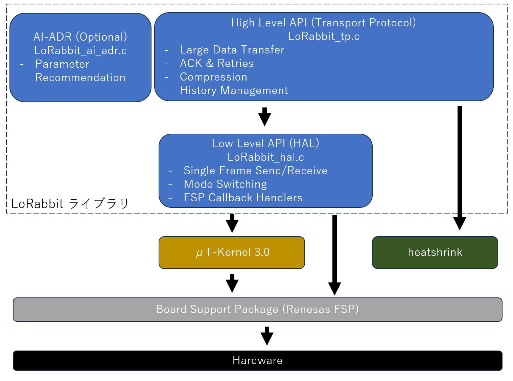

# LoRabbit ライブラリアーキテクチャ

LoRabbit ライブラリのアーキテクチャに付いて説明します。まずはアーキテクチャ図を示します。

# LoRabbit ライブラリ

ライブラリは、大きく分けて高レベル層と低レベル層に分かれています。

## High-Level API (Transport Protocol & AI-ADR)

- 役割: ユーザーにとって使いやすい、高機能なAPIを提供します。通信の複雑な部分を隠蔽するのがこの層の目的です
- 該当ファイル: `LoRabbit_tp.h`, `LoRabbit_tp.c`, `LoRabbit_ai_adr.h`, `LoRabbit_ai_adr.c`
- 主な機能:
  - 大容量データの分割送信と再構築 (`LoRabbit_SendData`, `LoRabbit_ReceiveData`)
  - データの圧縮・伸長を伴う送受信 (`LoRabbit_SendCompressedData`, `LoRabbit_ReceiveCompressedData`)
  - ACK（応答確認）と再送処理による信頼性の確保
  - 通信履歴の管理 (`LoRabbit_ExportHistoryCSV`)
  - AIによる最適な通信パラメータの推奨 (`LoRabbit_Get_AI_Recommendation`)
- 依存関係: これらの機能を実現するため、内部で下位層である「Low-Level API」を呼び出します

## Low-Level API (HAL)

- 役割: HAL (Hardware Abstraction Layer) とも呼ばれ、LoRaモジュールを直接制御するための基本的なAPIを提供します
- 該当ファイル: `LoRabbit_hal.h`, `LoRabbit_hal.c`
- 主な機能:
  - 1フレーム（1パケット）単位の単純な送受信 (`LoRabbit_SendFrame`, `LoRabbit_ReceiveFrame`)
  - ライブラリハンドルの初期化 (`LoRabbit_Init`)
  - LoRaモジュールの動作モード（通常、設定など）の切り替え
  - FSPの割り込みコールバックから呼び出されるハンドラ関数
  - 依存関係: 下位層である「プラットフォーム」のFSPドライバやRTOSの機能を直接呼び出します。

# プラットフォームと外部ライブラリ

## Board Suppoort Package (Renesas FSP)

LoRabbitライブラリが動作するための基盤となるドライバ群です。HAL層は、UARTでのバイト送受信や、M0/M1ピンのHigh/Low切り替えのためにFSPのAPIを呼び出します。

## μT-Kernel 3.0 (RTOS)

送信完了や受信開始を待つためのセマフォや、複数タスクからの安全なアクセスのためのミューテックスといった機能を提供し、ライブラリの安定動作に不可欠な役割を担っています。

## heatshrink ライブラリ (外部ライブラリ)

LoRabbitは、LoRa通信で大容量データを効率的に転送するため、データ圧縮・伸張機能を提供しています。この機能は、組み込みシステム向けに設計された軽量な圧縮ライブラリである `heatshrink` を利用して実現されています。

heatshrinkライブラリは、LoRabbitの高レベルAPI層に統合されています。

## Hardware

Renesas RAシリーズのマイクロコントローラや、LoRaモジュールなどの物理的な電子部品です。
