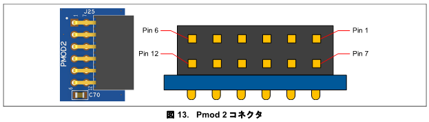
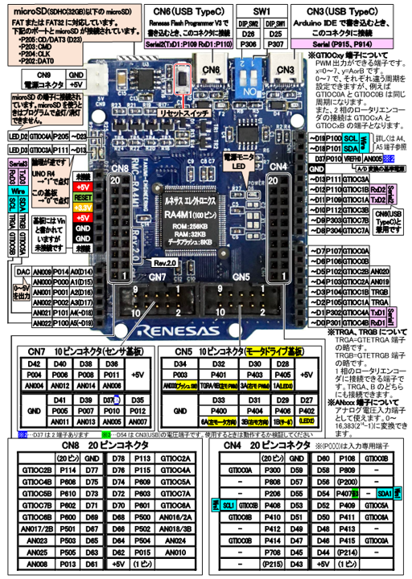

# 詳細セットアップガイド

ここでは LoRabbit ライブラリや各種サンプルプログラム、サンプルアプリケーションを動作させるための技術情報を記述しています。

# LoRabbit ライブラリを導入した開発の流れ

Renesas 製 IDE である e2_studio の使用を想定しています。

## 新規プロジェクトを作成する

## 各種ソースコードをプロジェクトに追加する

- [LoRabbit ライブラリ][lorabbit-link]
- [μT-Kernel 3.0 BSP2][mtk3_bsp2-link]
- [heatshrink ライブラリ][heatshrink-link]
- (optional) [lora_adr][lora_adr-link]
  - LoRabbit ライブラリの設定で LORABBIT_USE_AI_ADR を有効化する場合。詳しくは [LoRabbit ライブラリ設定](#lorabbit-ライブラリ設定) をご参照下さい

## 外部ハードウェアとの接続を行う

- 詳しくは [外部ハードウェアとの接続](#外部ハードウェアとの接続) をご参照下さい

## LoRabbit ライブラリ設定を行う

- 詳しくは [LoRabbit ライブラリ設定](#lorabbit-ライブラリ設定) をご参照下さい。
  - LoRabbit_config.h を編集するか、e2_studio で GNU Arm Cross C Compiler の Preprocessor に指定するのでも OK です

## FSP (Flexible Software Package) の設定を行う

- 詳しくは [FSP (Flexible Software Package) の設定](#fsp-flexible-software-package-設定) をご参照下さい

## LoRabbit ライブラリを使ってコーディングをする

- 詳しくは [LoRabbit ライブラリの使い方](#lorabbit-ライブラリの使い方) をご参照下さい

## 実行 or デバッグを行う

- 使用しているボードの仕様に沿って実行 or デバッグを実施します
- e2_studio では実行・デバッグが可能です
- Renesas Flash Programmer を使って実行ファイルを書き込むことで実行させることも可能です

## ログを確認する

- 

# 外部ハードウェアとの接続

EK-RA8D1、RMC-RA4M1 における外部ハードウェアとの接続について説明します。他のボードを利用して動作させたい場合、こちらの説明を参照しつつボードの仕様に合わせて接続するようにしてください。

## EK-RA8D1 Pmod2 コネクタ図

参考として EK-RA8D1 Pmod2 コネクタ図の画像を示します。



## RMC-RA4M1 ピン配置

参考として RMC-RA4M1 ピン配置図の画像を示します。



## LoRa モジュール

LoRabbit ライブラリ、各種サンプルプログラム、サンプルアプリケーションほぼすべてにおいて LoRa モジュールとの接続が必要です。 (heatshrink を使ったサンプルプログラムを除く)

対応モジュールについては下記になります。

- LoRa モジュール
  - CLEALINK 社製 E220-900T22S
  - 作者の手元では [E220-900T22S(JP) 用評価ボード][lora-ev-link] を用いて動作確認を行っています
  - 他のモジュール (E220-900T22S(JP)R2、E220-900T22L(JP)) につきましてはインターフェース仕様が共通のため動作すると思われますが、未確認です

### EK-RA8D1 における接続

下記のように接続します。

| EK-RA8D1 Pmod 2 コネクタ| E220-900T22S(JP) 用評価ボード |
|---|---|
| Pin 2: TXD2  | RxD |
| Pin 3: RXD2  | TxD |
| Pin 7: INT   | AUX |
| Pin 9: GPIO  | M0  |
| Pin 10: GPIO | M1  |
| Pin 11: GND  | GND |
| Pin 12: VCC  | VCC |

### RMC-RA4M1 における接続

下記のように接続します。

| RMC-RA4M1 | E220-900T22S(JP) 用評価ボード |
|---|---|
| P101: TxD3   | RxD |
| P102: RxD3   | TxD |
| P105: INT    | AUX |
| P303: GPIO   | M0  |
| P304: GPIO   | M1  |
| GND          | GND |
| +3.3V        | VCC |

なお、RMC-RA4M1 は IO レベルが 5V、E220-900T22S(JP) 用評価ボードが IO レベルが 3.3V のため、接続の際には間にレベルシフタ回路などを入れるようにして下さい。作者の手元では [4ビット双方向ロジックレベル変換モジュール][BSS138-link] を2つ使ってレベル変換を実施しています。M0、M1ピンについては速度がネックになる処理はないため、プルアップ抵抗とダイオードによる回路でもレベル変換が可能です。

## SPI カメラ

SPI カメラはサンプルアプリケーションの remote_camera_capture におけるRMC-RA4M1 側プロジェクトで必要です。

SPI カメラは下記の製品を想定しています。

- [Arducam MEGA SPI Camera][MEGA-SPI-Camera-link]
  - 作者の手元では [Mega 5MP SPI Camera Module][Mega-5MP-SPI-Camera-link] を用いて動作確認を行っています
  - Arducam MEGA SPI Camera シリーズなら SPI のコマンド互換性があるので、他のモジュールでも OK です

### RMC-RA4M1 における接続

下記のように接続します。

| RMC-RA4M1    | Mega 5MP SPI Camera Module |
|---|---|
| P410: MISOA  | MISO |
| P411: MOSIA  | MOSI |
| P412: RSPCKA | SCK  |
| P413: GPIO   | CS   |
| GND          | GND |
| +3.3V        | VCC |

## プッシュボタン

プッシュボタンはサンプルアプリケーションの comm_log_collector における、
RMC-RA4M1 側プロジェクトで必要です。

作者は [DFRobot の Digital Push Button][DFR0029-link] を用いて動作確認を行っていますが、他の製品も利用可能です。ただし、立ち上がりエッジが Rising か Falling かは確認して下さい。プロジェクトの FSP 設定では Rising Edge で設定しています。

### RMC-RA4M1 における接続

下記のように接続します。

| RMC-RA4M1    | Mega 5MP SPI Camera Module |
|---|---|
| P104: IRQ01  | Input |
| GND          | GND   |
| +3.3V        | VCC   |

## デバッグ用シリアル出力 UART

こちらについては [μT-Kernel 3.0 BSP2 ユーザーズマニュアル](https://github.com/tron-forum/mtk3_bsp2/blob/main/doc/bsp2_ra_fsp_jp.md#22-%E3%83%87%E3%83%90%E3%83%83%E3%82%B0%E7%94%A8%E3%82%B7%E3%83%AA%E3%82%A2%E3%83%AB%E5%87%BA%E5%8A%9B) の「2.2. デバッグ用シリアル出力」をご参照下さい。

# LoRabbit ライブラリ設定

LoRabbit_config.h の define を設定することで LoRabbit ライブラリの挙動を変更することができます。

## LORABBIT_HISTORY_SIZE

通信履歴を保存するリングバッファのサイズを指定します。初期値は 32 です。

## LORABBIT_TP_RETRY_COUNT

Transport 層の API (LoRabbit_SendData や LoRabbit_ReceiveData など) において、通信失敗時のリトライ回数を指定します。初期値は 3 です。

## LORABBIT_TP_ACK_TIMEOUT_MS

Transport 層の API (LoRabbit_SendData や LoRabbit_ReceiveData など) において、ACK を受け取る際のタイムアウト時間を指定します。初期値は 2000 (ms) = 2秒 です。

## LORABBIT_USE_AUX_IRQ

LoRa モジュールの補助信号 (AUX) ピンを使った処理を有効化するかどうかを指定します。初期値は無効化 (使わない) ですが、これは LoRabbit ライブラリ導入時の動作確認を用意にすることを意図したもので、設定することを強く推奨します。有効化することで割り込みと μT-Kernel の同期機構を使って送受信処理を最適化しています。こちらを無効化すると、送信時は仕様から算出された待ち時間を必ず待ち、受信時はタイムアウト指定することができません。

## LORABBIT_DEBUG_MODE

LoRabbit ライブラリのデバッグ出力を有効化するかどうかを指定します。初期値は無効化 (出力しない) です。

## LORABBIT_USE_AI_ADR

AI による推論 API (LoRabbit_Get_AI_Recommendation) を使うかどうかを指定します。初期値は無効化 (使用しない) です。

# FSP (Flexible Software Package) 設定

プロジェクトにおける FSP 設定について説明します。

## LoRa モジュール通信用 UART

| Group |設定項目      | 値 |
|---|---|---|
| General    | Data Bits    | 8bits |
| General    | Parity       | None  |
| General    | Stop Bits    | 1bit  |
| Baud       | Baud Rate    | 9600  |
| Interrupts | Callback     | 必ず指定すること |

起動時、設定した UART インスタンスを使ってオープンしてください。

```
// LoRa用UARTモジュールを初期化
g_uart2.p_api->open(g_uart2.p_ctrl, g_uart2.p_cfg);
```

また、割り込みの Callback は指定した上で、下記のように LoRabbit ライブラリのハンドラ関数を呼び出して下さい。

```
void g_uart_callback(uart_callback_args_t *p_args) {
    // ライブラリ提供のハンドラを呼び出し、処理を委譲する
    LoRabbit_UartCallbackHandler(&s_lora_handle, p_args);
}
```

## LoRa モジュール制御信号(AUX) ピン用 ICU

|設定項目      | 値 |
|---|---|
| Trigger      | Both Edges |
| Callback     | 必ず指定すること  |

起動時、設定した IRQ インスタンスをオープンした上で、割り込みを有効化してください。

```
p_irq1->p_api->open(p_irq1->p_ctrl, p_irq1->p_cfg);
p_irq1->p_api->enable(p_irq1->p_ctrl);
```

割り込みの Callback は指定した上で、下記のように LoRabbit ライブラリのハンドラ関数を呼び出して下さい。

```
void g_irq_callback(external_irq_callback_args_t *p_args) {
    // ライブラリ提供のハンドラを呼び出し、処理を委譲する
    LoRabbit_AuxCallbackHandler(&s_lora_handle, p_args);
}
```

## LoRa モジュール M0, M1 ピン用 GPIO

|設定項目 | 値 |
|---|---|
| Mode     | Output mode (Initial Low) |

## SPI カメラ用 SPI

|設定項目 | 値 |
|---|---|
| Receive Interrupt Priority           | Priority 12       |
| Transfer Complete Interrupt Priority | Priority 12       |
| Operating Mode                       | Master            |
| Callback                             | spi_master_handle |
| Bitrate                              | 4000000           |

Bitrate は更に高速でも動作する可能性がありますが、MCU との接続ケーブル長を短く構成する必要があります。

## SPI カメラ CS 用 GPIO

|設定項目 | 値 |
|---|---|
| Mode     | Output mode (Initial High) |

## プッシュボタン用 ICU

|設定項目      | 値 |
|---|---|
| Trigger                        | Falling or Rising |
| Digital Filtering              | Enabled           |
| Digital Filtering Sample Clock | PCLK / 64         |
| Callback                       | 必ず指定すること   |

ボタンの特性によって Trigger の値は変更して下さい。例えば EK-RA8D1 のボード上の S1, S2 ボタンは Falling、RMC-RA4M1 に取り付けたボタンは Rising でした。

起動時、設定した IRQ インスタンスをオープンした上で、割り込みを有効化してください。

```
p_irq1->p_api->open(p_irq1->p_ctrl, p_irq1->p_cfg);
p_irq1->p_api->enable(p_irq1->p_ctrl);
```

割り込みの Callback は指定した上で、下記のように LoRabbit ライブラリのハンドラ関数を呼び出して下さい。

```
void g_irq_callback(external_irq_callback_args_t *p_args) {
    // ライブラリ提供のハンドラを呼び出し、処理を委譲する
    LoRabbit_AuxCallbackHandler(&s_lora_handle, p_args);
}
```

# LoRabbit ライブラリの使い方

## 初期化

```c
// main.c

// LoRaハンドルの実体
static LoraHandle_t s_lora_handle;

// ハードウェア構成を定義
LoraHwConfig_t lora_hw_config = {
    .p_uart = &g_uart_instance,
    .m0     = BSP_IO_PORT_XX_PIN_YY,
    .m1     = BSP_IO_PORT_XX_PIN_YY,
    .aux    = BSP_IO_PORT_XX_PIN_YY,
    .pf_baud_set_helper = my_baud_set_wrapper_function,
};

// LoRaライブラリを初期化
LoRabbit_Init(&s_lora_handle, &lora_hw_config);

// LoRaモジュールを初期化
LoRabbit_InitModule(&s_lora_handle, &initial_lora_config);
```

## パケットの送受信

```c
// Send
int err = LoRabbit_SendFrame(&s_lora_handle, SERVER_ADDR, SERVER_CHAN, send_buffer, len);

// Receive
RecvFrameE220900T22SJP_t recv_frame;
int err = LoRabbit_ReceiveFrame(&s_lora_handle, &recv_frame, TMO_FEVR)
```

## 大容量データの送受信

```c
// Client Task
int err = LoRabbit_SendData(&s_lora_handle, SERVER_ADDR, SERVER_CHAN, my_data, sizeof(my_data), true);

// Server Task
uint32_t received_len = 0;
int err = LoRabbit_ReceiveData(&s_lora_handle, rx_buffer, sizeof(rx_buffer), &received_len, TMO_FEVR);
```

## 大容量データの送受信 (圧縮・伸長付き)

```c
// Client Task
int err = LoRabbit_SendCompressedData(&s_lora_handle, SERVER_ADDR, SERVER_CHAN, my_data, sizeof(my_data), true);

// Server Task
uint32_t received_len = 0;
int err = LoRabbit_ReceiveCompressedData(&s_lora_handle, rx_buffer, sizeof(rx_buffer), &received_len, TMO_FEVR);
```

## AI-ADR 機能の活用

```c
// Client Task (after a communication)

LoRaRecommendedConfig_t recommend;
int err = LoRabbit_GetAIRecommendation(&s_lora_handle, &recommend);

if (err == LORABBIT_OK) {
    // サーバーに推奨設定を送信し、ネゴシエーション...
}
```

# baudrate 設定ヘルパー関数について

LoRa モジュールにおける UART 通信の baudrate は変更することができ、LoRabbit ライブラリも対応しています。当然ながら、LoRa モジュールの設定を変更した場合、MCU 側の baudrate も変更する必要があります。

この baudrate 変更についてはユーザの方でヘルパー関数を指定する仕様にしました。それは以下の2つの理由からです。

1. FSP に baudrate を変更する API (baudSet) は存在するが、設定値を作成する API が存在しない

```c
これはある
p_uart->p_api->baudSet(...)

ない
p_uart->p_api->baudCalculate(...)
```

2. ボードによって、UART デバイスが異なる
- EK-RA8D1 なら sci_b_uart
- RMC-RA4M1 なら sci_uart

```c
sci_b_uart の Baudrate 設定値作成関数は
R_SCI_B_UART_BaudCalculate

sci_uart の Baudrate 設定値作成関数は
R_SCI_UART_BaudCalculate
```

これらの理由により、デバイス固有の関数をライブラリ内で記述することとなるため、結果としてユーザ側マクロでデバイス指定する必要がありました。そのためライブラリの柔軟性を維持するため、今回はヘルパー関数を導入しています。

一応各種サンプルプログラムにはヘルパー関数例を記述していますので、参考にして下さい。

## sci_b_uart 用 baudrate 設定ヘルパー関数の記述例

```c
int my_sci_b_uart_baud_set_helper(LoraHandle_t *p_handle, uint32_t baudrate) {
    fsp_err_t err = FSP_SUCCESS;
    uart_instance_t const *p_uart = p_handle->hw_config.p_uart;

    // ドライバ固有のBaudCalculate関数を呼び出す
    sci_b_baud_setting_t baud_setting;
    memset(&baud_setting, 0x0, sizeof(sci_b_baud_setting_t));
    err = R_SCI_B_UART_BaudCalculate(baudrate,
                                     false, // Bitrate Modulation 無効
                                     5000,  // 許容エラー率 (5%)
                                     &baud_setting);
    if (FSP_SUCCESS != err) {
        LOG("R_SCI_B_UART_BaudCalculate failed\n");
        // 計算失敗
        return -1;
    }

    // mddr (上位8bit) が 0x80 になっているが、Bitrate Modulation (brme) が 0 になっているので無視される
    LOG("baudrate=%dbps, baud_setting.baudrate_bits: 0x%08x\n",
            baudrate, baud_setting.baudrate_bits);

    // 計算結果を void* にキャストして、抽象APIである baudSet に渡す
    err = p_uart->p_api->baudSet(p_uart->p_ctrl, (void*)&baud_setting);

    return (FSP_SUCCESS == err) ? 0 : -1;
}
```
## sci_uart 用 baudrate 設定ヘルパー関数の記述例

```c
int my_sci_uart_baud_set_helper(LoraHandle_t *p_handle, uint32_t baudrate) {
    fsp_err_t err = FSP_SUCCESS;
    uart_instance_t const *p_uart = p_handle->hw_config.p_uart;

    // ドライバ固有のBaudCalculate関数を呼び出す
    baud_setting_t baud_setting;
    memset(&baud_setting, 0x0, sizeof(baud_setting_t));

    err = R_SCI_UART_BaudCalculate(baudrate,
                                   false, // Bitrate Modulation 無効
                                   5000,  // 許容エラー率 (5%)
                                   &baud_setting);
    if (FSP_SUCCESS != err) {
        tm_printf((UB*)"R_SCI_UART_BaudCalculate failed\n");
        // 計算失敗
        return -1;
    }

    // mddr が 0x80 になっているが、Bitrate Modulation (brme) が 0 になっているので無視される
    tm_printf((UB*)"baudrate=%dbps, baud_setting.(semr_baudrate_bits, cks, brr, mddr)=(0x%02x, %d, 0x%02x, 0x%02x)\n",
            baudrate, baud_setting.semr_baudrate_bits, baud_setting.cks, baud_setting.brr, baud_setting.mddr);

    // 計算結果を void* にキャストして、抽象APIである baudSet に渡す
    err = p_uart->p_api->baudSet(p_uart->p_ctrl, (void*)&baud_setting);

    return (FSP_SUCCESS == err) ? 0 : -1;
}
```

[lorabbit-link]: https://github.com/men100/LoRabbit/tree/main/src/LoRabbit
[mtk3_bsp2-link]: https://github.com/tron-forum/mtk3_bsp2/
[heatshrink-link]: https://github.com/men100/heatshrink/tree
[lora_adr-link]: https://github.com/men100/LoRabbit/tree/main/src/lora_adr
[lora-ev-link]: https://dragon-torch.tech/rf-modules/lora/
[MEGA-SPI-Camera-link]: https://docs.arducam.com/Arduino-SPI-camera/MEGA-SPI/MEGA-SPI-Camera/
[Mega-5MP-SPI-Camera-link]: https://www.arducam.com/presale-mega-5mp-color-rolling-shutter-camera-module-with-autofocus-lens-for-any-microcontroller.html
[BSS138-link]: https://akizukidenshi.com/catalog/g/g113837/
[DFR0029-link]: https://wiki.dfrobot.com/DFRobot_Digital_Push_Button_SKU_DFR0029
